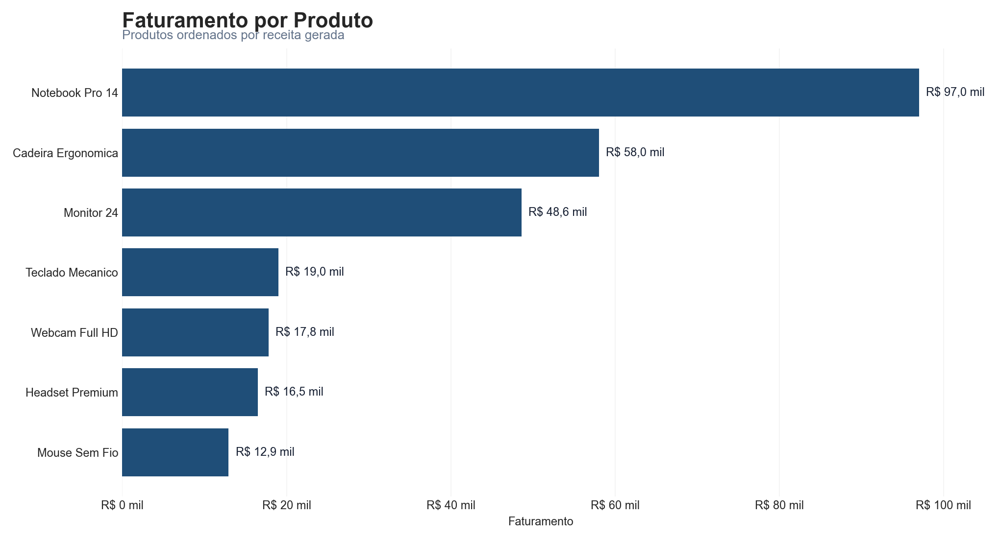
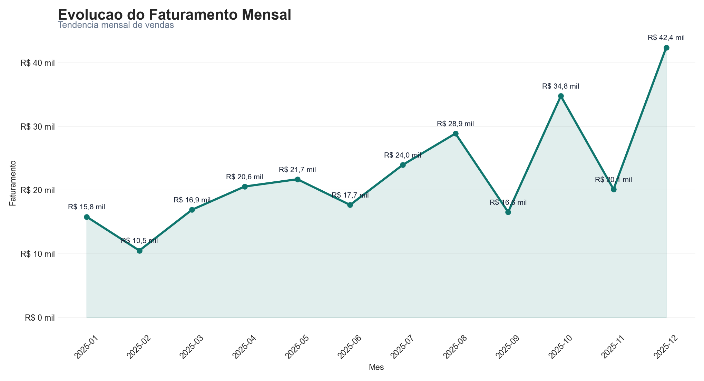
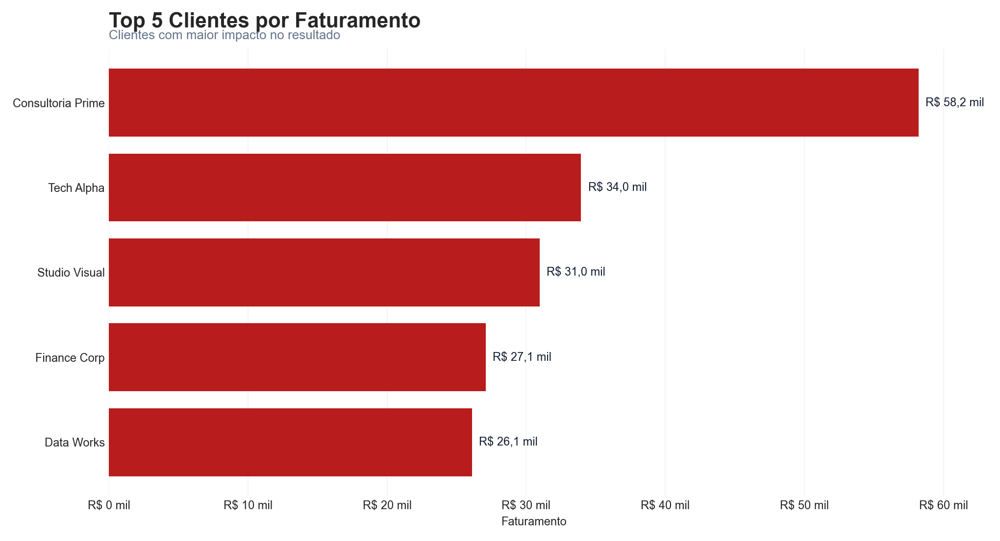
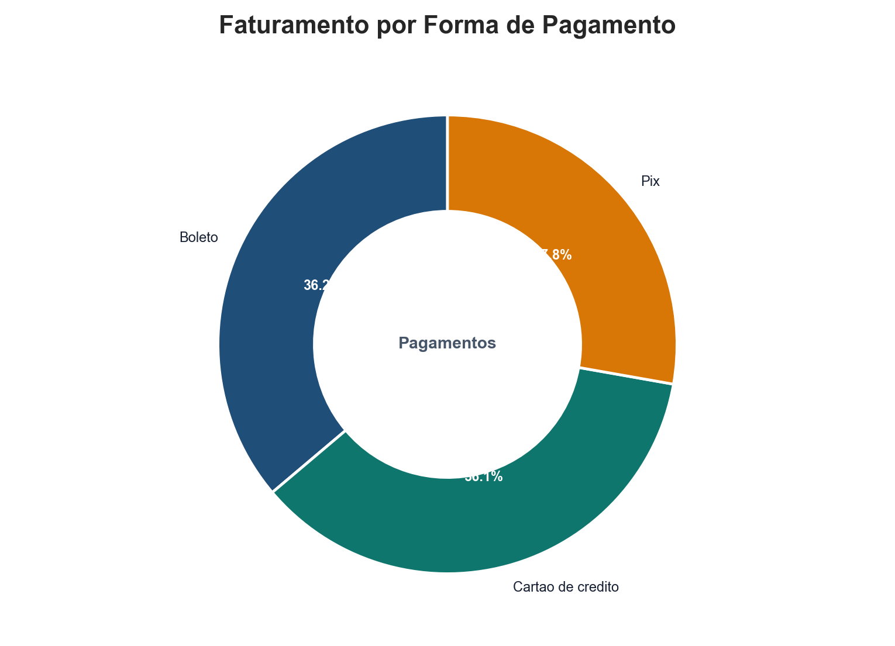

# Sales Report Automation

Automacao de relatorios de vendas com Python. O projeto transforma uma planilha CSV ou Excel em indicadores comerciais, relatorio profissional em Excel, graficos em imagem e dashboard HTML.

## Problema resolvido

Muitos negocios pequenos ainda montam relatorios de vendas manualmente em planilhas. Isso consome tempo, aumenta risco de erro e dificulta enxergar rapidamente os resultados.

Este projeto automatiza esse processo:

```text
planilha de vendas -> tratamento com Python -> metricas -> Excel + graficos + dashboard
```

## Entregaveis gerados

- `relatorio_vendas.xlsx`: relatorio Excel com resumo executivo, base tratada e abas analiticas
- `grafico_faturamento_produto.png`: faturamento por produto
- `grafico_vendas_mes.png`: evolucao mensal do faturamento
- `grafico_top_clientes.png`: clientes com maior faturamento
- `grafico_formas_pagamento.png`: distribuicao do faturamento por forma de pagamento
- `dashboard.html`: painel visual simples para consulta dos resultados

## Indicadores calculados

- faturamento total
- ticket medio
- quantidade total vendida
- total de pedidos
- produto mais vendido
- melhor mes de venda
- cliente com maior faturamento
- vendas por produto
- vendas por mes
- vendas por cliente
- vendas por estado
- vendas por forma de pagamento
- crescimento percentual mensal

## Stack utilizada

- Python
- Pandas
- Matplotlib
- OpenPyXL
- Excel

## Estrutura do projeto

```text
analise-vendas-python/
|-- dados/
|   |-- vendas.csv
|-- entrada/
|   |-- vendas.csv
|-- saida/
|   |-- relatorio_vendas.xlsx
|   |-- grafico_faturamento_produto.png
|   |-- grafico_vendas_mes.png
|   |-- grafico_top_clientes.png
|   |-- grafico_formas_pagamento.png
|   |-- dashboard.html
|-- src/
|   |-- analise_vendas.py
|-- executar_relatorio.bat
|-- README.md
|-- requirements.txt
```

## Como usar como cliente

1. Coloque a planilha de vendas na pasta `entrada/`
2. Clique duas vezes em `executar_relatorio.bat`
3. Abra a pasta `saida/`
4. Consulte o Excel, os graficos e o dashboard gerados automaticamente

O sistema aceita arquivos `.csv`, `.xlsx` e `.xls`.

## Como executar pelo terminal

Instale as dependencias:

```bash
pip install -r requirements.txt
```

Execute a automacao:

```bash
python src/analise_vendas.py
```

No Windows, se o comando `python` nao funcionar, use:

```bash
py -3 src/analise_vendas.py
```

## Colunas esperadas na planilha

A planilha de entrada precisa conter estas colunas:

- `data_venda`
- `produto`
- `categoria`
- `quantidade`
- `preco_unitario`
- `cliente`
- `cidade`
- `estado`
- `forma_pagamento`

## Resultado visual

Depois da execucao, os graficos ficam disponiveis em `saida/` e tambem aparecem dentro do dashboard HTML.









## Descricao para portfolio

Crio automacoes em Python para transformar planilhas de vendas em relatorios organizados com indicadores, graficos e dashboard. A solucao reduz trabalho manual, padroniza analises e facilita o acompanhamento comercial.

## Possiveis evolucoes

- filtros por periodo no dashboard
- envio automatico do relatorio por e-mail
- leitura de multiplas planilhas na mesma execucao
- versao com interface grafica
- deploy em Streamlit
